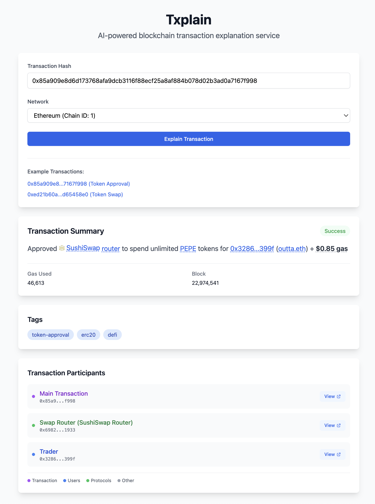

# txplain

An open-source AI-powered blockchain transaction explanation service that transforms complex blockchain transaction data into human-readable summaries. Built with a **RPC-first architecture**, it uses direct blockchain calls and contract introspection to provide accurate and comprehensive transaction analysis.



## High-Level Architecture

Txplain uses a modular RPC-first design that prioritizes direct blockchain calls over hard-coded mappings:

```
┌─────────────────┐    ┌──────────────────┐    ┌─────────────────┐
│   CLI/HTTP/MCP  │    │    Agent         │    │  Blockchain     │
│   Interfaces    │───▶│  Orchestrator    │───▶│  RPC Clients    │
└─────────────────┘    └──────────────────┘    └─────────────────┘
                              │                        │
                              ▼                        │
                    ┌──────────────────┐               │
                    │  Enhanced Tools  │               │
                    │                  │               │
                    │ • RPC TraceDecoder◀──────────────┤
                    │ • RPC LogDecoder   │               │
                    │ • AI Explainer     │               │
                    └──────────────────┘               │
                              │                        │
                              ▼                        │
                    ┌──────────────────┐               │
                    │  RPC Services    │◀──────────────┘
                    │                  │
                    │ • Contract Info  │
                    │ • Signature Resolver │
                    │ • Token Metadata │
                    └──────────────────┘
```

### Key Features

- 🔍 **Dynamic Contract Introspection**: Automatically detects ERC20, ERC721, ERC1155 tokens via `supportsInterface()` calls
- 📝 **Real-time Signature Resolution**: Uses 4byte.directory API as fallback for unknown function/event signatures  
- 💰 **Live Token Metadata**: Fetches name, symbol, decimals directly from contracts
- 🧠 **AI-Powered Analysis**: Uses OpenAI's GPT-4 with RPC-enhanced context for accurate explanations
- 🌐 **Multi-Network Support**: Ethereum, Polygon, and Arbitrum
- ⚡ **Minimal External Dependencies**: Only uses external APIs when RPC calls aren't sufficient

## Installation

### Prerequisites

- Go 1.23.0 or later  
- OpenAI API key

### Setup

```bash
# Clone the repository
git clone https://github.com/your-username/txplain.git
cd txplain

# Install dependencies
go mod download

# Create configuration file from template
cp example.env .env

# Edit .env file with your API keys and network configurations
# At minimum, set your OpenAI API key:
# OPENAI_API_KEY=your_openai_api_key_here

# Build the application
go build -o txplain cmd/main.go
```

## Configuration

### Network Configuration

Txplain supports flexible network configuration through environment variables. You can easily add support for new blockchain networks without modifying the code.

#### Environment Variable Patterns

```bash
# RPC Endpoints (Required)
RPC_ENDPOINT_CHAIN_<CHAIN_ID>=<RPC_URL>

# Network Names (Optional)
NETWORK_NAME_CHAIN_<CHAIN_ID>=<NETWORK_NAME>

# Explorer URLs (Optional)
EXPLORER_URL_CHAIN_<CHAIN_ID>=<EXPLORER_URL>
```

#### Default Networks

If no environment variables are configured, Txplain uses these default networks:

- **Ethereum (1)**: Built-in RPC endpoint with Etherscan explorer
- **Polygon (137)**: Built-in RPC endpoint with Polygonscan explorer  
- **Arbitrum (42161)**: Built-in RPC endpoint with Arbiscan explorer

#### Adding New Networks

To add support for a new blockchain network, simply add the environment variables to your `.env` file:

```bash
# Example: Add Binance Smart Chain
RPC_ENDPOINT_CHAIN_56=https://bsc-dataseed.binance.org
NETWORK_NAME_CHAIN_56=Binance Smart Chain
EXPLORER_URL_CHAIN_56=https://bscscan.com

# Example: Add Avalanche
RPC_ENDPOINT_CHAIN_43114=https://api.avax.network/ext/bc/C/rpc
NETWORK_NAME_CHAIN_43114=Avalanche
EXPLORER_URL_CHAIN_43114=https://snowtrace.io
```

### Configuration File

Create a `.env` file from the provided template and configure your API keys:

```bash
# Copy the example configuration
cp example.env .env

# Edit .env with your settings
```

**Required variables in `.env`:**
```bash
# OpenAI API key for transaction analysis
OPENAI_API_KEY=your_openai_api_key_here

# Etherscan API key for contract verification  
ETHERSCAN_API_KEY=your_etherscan_api_key_here
```

## GUI Server

1. Run the code with -http flag:

    ```sh
    go run ./cmd/main.go -http
    ```

2. Visit `http://localhost:8080/`

## Examples

### Example 1: Token Approval Transaction

```bash
➜  txplain git:(main) go run ./cmd/main.go -tx 0x85a909e8d6d173768afa9dcb3116f88ecf25a8af884b078d02b3ad0a7167f998 -network 1 

Approved Uniswap v2 Router to spend unlimited PEPE tokens from 0x3286...399f (outta.eth).
```

### Example 2: Token Swap Transaction

```bash
➜  txplain git:(main) go run ./cmd/main.go -tx 0xed21b60a115828a7bdaaa6d22309e3a5ba47375b926d18fa8e5768a1d65458e0 -network 1   

Swapped 100 USDT ($100) for 57,071 GrowAI tokens via 1inch v6 aggregator with $1.02 gas fee.
```

### Example 3: Repaying Debt

```
➜  txplain git:(main) ✗ go run ./cmd/main.go -tx 0x715344c0f9a035577e221db859394cb301f577540475d2d3b1709deec605925d -network 1
Repaid 25 USDC debt and withdrew collateral on Curve for 0xea7b...1889 for 25 USDC + $0.55 gas.
```

### Additional Usage

```bash
# Run HTTP API server (default port 8080)
./txplain

# Run with custom ports
./txplain -http-addr=":3000" -mcp-addr=":3001"

# Run only HTTP server
./txplain -mcp=false
```

## Acknowledgments

- [LangChainGo](https://github.com/tmc/langchaingo) for the LLM integration framework
- [Gorilla Mux](https://github.com/gorilla/mux) for HTTP routing
- [4byte.directory](https://4byte.directory) for function signature resolution
- OpenAI for providing the GPT-4 model
- The Ethereum community for comprehensive RPC documentation

---

**Txplain** - RPC-powered blockchain transaction analysis that actually understands your contracts! 🚀⚡
