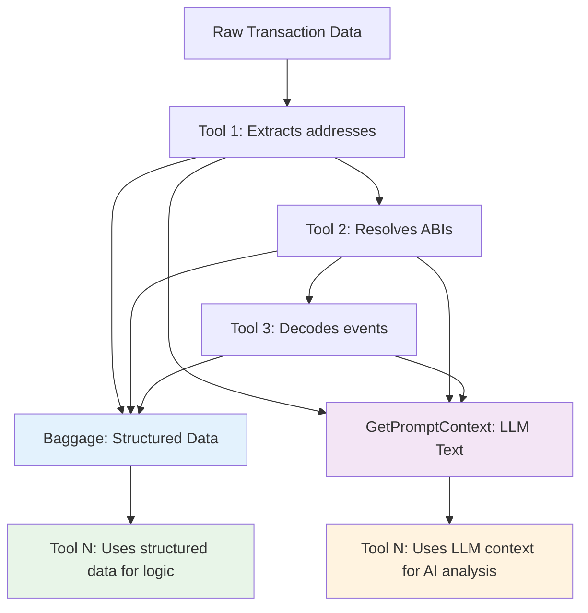

# txplain

> Pronounce: Tex-plain

An open-source AI-powered blockchain transaction explanation service that transforms complex blockchain transaction data into human-readable summaries. Built with a **RPC-first architecture**, it uses direct blockchain calls and contract introspection to provide accurate and comprehensive transaction analysis.


## High-Level Architecture

Txplain uses a modular RPC-first design that prioritizes direct blockchain calls over hard-coded mappings:

```
┌─────────────────┐    ┌──────────────────┐    ┌─────────────────┐
│   CLI/HTTP/MCP  │    │    Agent         │    │  Blockchain     │
│   Interfaces    │───▶│  Orchestrator    │───▶│  RPC Clients    │
└─────────────────┘    └──────────────────┘    └─────────────────┘
                              │                        │
                              ▼                        │
                    ┌──────────────────┐               │
                    │  Enhanced Tools  │               │
                    │                  │               │
                    │ • RPC TraceDecoder◀──────────────┤
                    │ • RPC LogDecoder   │               │
                    │ • AI Explainer     │               │
                    └──────────────────┘               │
                              │                        │
                              ▼                        │
                    ┌──────────────────┐               │
                    │  RPC Services    │◀──────────────┘
                    │                  │
                    │ • Contract Info  │
                    │ • Signature Resolver │
                    │ • Token Metadata │
                    └──────────────────┘
```

### Key Features

- 🔍 **Dynamic Contract Introspection**: Automatically detects ERC20, ERC721, ERC1155 tokens via `supportsInterface()` calls
- 📝 **Real-time Signature Resolution**: Uses 4byte.directory API as fallback for unknown function/event signatures  
- 💰 **Live Token Metadata**: Fetches name, symbol, decimals directly from contracts
- 🧠 **AI-Powered Analysis**: Uses OpenAI's GPT-4 with RPC-enhanced context for accurate explanations
- 🌐 **Multi-Network Support**: Ethereum, Polygon, and Arbitrum
- ⚡ **Minimal External Dependencies**: Only uses external APIs when RPC calls aren't sufficient

## Architecture Principles

⚠️ **CRITICAL**: All contributors and AI assistants MUST follow these architecture principles when working on this codebase.

### Core Design Philosophy

Txplain follows a **clean, decoupled pipeline architecture** where each tool is completely isolated and communicates through well-defined interfaces. This ensures zero logic leaks, maximum testability, and easy extensibility.

### 🏗️ Tool Architecture Rules

**Each tool MUST follow these 4 principles:**

#### 1. **Dependencies Declaration** 
```go
func (t *MyTool) Dependencies() []string {
    return []string{"dependency1", "dependency2"} // Enforces execution order
}
```

#### 2. **Structured Data to Baggage**
```go
// ✅ GOOD: Add structured data for other tools' deterministic logic
baggage["my_structured_data"] = MyStructuredData{...}
```

#### 3. **Text Context via GetPromptContext()**  
```go
// ✅ GOOD: Provide LLM context for other tools' probabilistic logic
func (t *MyTool) GetPromptContext(ctx context.Context, baggage map[string]interface{}) string {
    return "### MY TOOL CONTEXT:\n- Useful context for LLM analysis"
}
```

#### 4. **Complete Tool Isolation**
```go
// ❌ FORBIDDEN: Never access baggage to build context from other tools
func (t *MyTool) buildContextFromOtherTools(baggage map[string]interface{}) string {
    // This violates isolation - DON'T DO THIS
}

// ✅ CORRECT: Use context from providers (same pattern as TransactionExplainer)
func (t *MyTool) Process(ctx context.Context, baggage map[string]interface{}) error {
    var additionalContext []string
    if contextProviders, ok := baggage["context_providers"].([]ContextProvider); ok {
        for _, provider := range contextProviders {
            if context := provider.GetPromptContext(ctx, baggage); context != "" {
                additionalContext = append(additionalContext, context)
            }
        }
    }
    contextData := strings.Join(additionalContext, "\n\n")
    // Use contextData for LLM calls
}
```

### 🔄 Context Flow Architecture



### 📦 Data Flow Patterns

#### ✅ **Correct Data Flow**

**For Deterministic Logic:**
```go
// Tool A produces structured data
baggage["token_transfers"] = []TokenTransfer{...}

// Tool B consumes structured data  
if transfers, ok := baggage["token_transfers"].([]TokenTransfer); ok {
    // Process transfers deterministically
}
```

**For LLM/AI Logic:**
```go
// Tool A provides context
func (a *ToolA) GetPromptContext(ctx context.Context, baggage map[string]interface{}) string {
    return "### TOKEN TRANSFERS:\n- USDT: 100 tokens transferred"
}

// Tool B uses context from providers
var additionalContext []string
if contextProviders, ok := baggage["context_providers"].([]ContextProvider); ok {
    for _, provider := range contextProviders {
        if context := provider.GetPromptContext(ctx, baggage); context != "" {
            additionalContext = append(additionalContext, context)
        }
    }
}
// Use additionalContext for LLM calls
```

### 🚫 Anti-Patterns (DO NOT DO)

#### ❌ **Hardcoded Logic**
```go
// DON'T: Hardcode specific event names or protocols
if eventName == "Approval" {
    // Hardcoded special case logic
}
```

#### ❌ **Direct Baggage Context Building** 
```go
// DON'T: Build context by directly accessing other tools' baggage data
func (t *MyTool) buildContext(baggage map[string]interface{}) string {
    if events, ok := baggage["events"].([]Event); ok {
        // This violates tool isolation
    }
}
```

#### ❌ **Logic Leaks Between Tools**
```go
// DON'T: Make tool behavior depend on internal details of other tools
if protocolName == "Uniswap" && version == "v3" {
    // This couples tools together
}
```

### 🛠️ Adding New Tools

When adding a new tool, follow this checklist:

1. **✅ Implement Required Interfaces**
   ```go
   type MyNewTool struct {
       // Tool state
   }
   
   func (t *MyNewTool) Name() string { return "my_new_tool" }
   func (t *MyNewTool) Dependencies() []string { return []string{"dependency1"} }
   func (t *MyNewTool) Process(ctx context.Context, baggage map[string]interface{}) error { ... }
   func (t *MyNewTool) GetPromptContext(ctx context.Context, baggage map[string]interface{}) string { ... }
   ```

2. **✅ Add to Pipeline in Agent**
   ```go
   myTool := txtools.NewMyNewTool()
   if err := pipeline.AddProcessor(myTool); err != nil {
       return nil, fmt.Errorf("failed to add my tool: %w", err)
   }
   contextProviders = append(contextProviders, myTool)
   ```

3. **✅ Use Generic, AI-Driven Logic Only**
   - Let the LLM handle classification and reasoning
   - Avoid hardcoding protocol names, event types, or special cases
   - Use structured data + context patterns exclusively

### 🧪 Testing New Tools

```go
// Test data flow
func TestMyToolDataFlow(t *testing.T) {
    tool := NewMyNewTool()
    baggage := map[string]interface{}{
        "input_data": testData,
    }
    
    // Test processing
    err := tool.Process(ctx, baggage)
    assert.NoError(t, err)
    
    // Test structured data output
    result, ok := baggage["my_output"].(MyOutputType)
    assert.True(t, ok)
    assert.NotEmpty(t, result)
    
    // Test context output
    context := tool.GetPromptContext(ctx, baggage)
    assert.Contains(t, context, "### MY TOOL CONTEXT:")
}
```

### 🎯 Benefits of This Architecture

- **🔄 Zero Coupling**: Tools can be added/removed/modified independently
- **🧪 100% Testable**: Each tool can be tested in isolation
- **🚀 Scalable**: New functionality doesn't break existing tools
- **🔍 Generic**: No hardcoded protocol or event logic anywhere
- **🧠 AI-Powered**: LLM handles all classification and reasoning
- **📦 Clean Interfaces**: Clear separation between structured data and LLM context

### 🚨 Enforcement

**Code reviewers and AI assistants MUST reject any code that:**
- Hardcodes protocol names, event types, or special cases
- Builds context by directly accessing other tools' baggage data  
- Creates dependencies between tools beyond the explicit dependency system
- Mixes deterministic logic with LLM context building

**This architecture enables the entire system to be generic, maintainable, and extensible.** 🎯

## Processing Pipeline Tools

Txplain uses a sophisticated pipeline of 19 specialized tools that work together to analyze blockchain transactions. Each tool is completely isolated and communicates through well-defined interfaces. The tools are executed in dependency order as determined by the pipeline's topological sort algorithm.

### 🔄 Tool Execution Order

The tools are executed in the following dependency-based order:

#### **Level 0 - Foundation Tools** (No dependencies)
1. **static_context_provider** - Loads CSV knowledge base
2. **transaction_context_provider** - Extracts basic transaction metadata  
3. **abi_resolver** - Fetches contract ABIs from Etherscan
4. **trace_decoder** - Decodes transaction traces into function calls

#### **Level 1 - Data Extraction** 
5. **log_decoder** - Decodes events using resolved ABIs
6. **token_metadata_enricher** - Fetches token metadata via RPC calls
7. **icon_resolver** - Discovers token icons from TrustWallet

#### **Level 2 - Structural Analysis**
8. **token_transfer_extractor** - Extracts token transfers from events
9. **nft_decoder** - Specialized NFT transfer analysis
10. **signature_resolver** - Resolves unknown signatures via 4byte.directory
11. **amounts_finder** - AI-powered detection of all monetary amounts
12. **erc20_price_lookup** - Fetches token prices via CoinMarketCap API

#### **Level 3 - Value Enhancement**
13. **protocol_resolver** - AI-powered protocol identification 
14. **monetary_value_enricher** - Converts amounts to USD values

#### **Level 4 - Identity Resolution**
15. **ens_resolver** - Resolves ENS names for addresses
16. **tag_resolver** - AI-powered transaction categorization

#### **Level 5 - Role Analysis**
17. **address_role_resolver** - Determines address roles and types (EOA/Contract)

#### **Level 6 - Final Analysis**
18. **transaction_explainer** - Generates human-readable explanations with RAG
19. **annotation_generator** - Creates interactive UI annotations

### 📋 Tool Details

#### **Foundation Tools**

##### **static_context_provider**
- **Purpose**: Loads curated knowledge base from CSV files (tokens, protocols, addresses)
- **Dependencies**: None
- **Output**: Static knowledge for RAG system and protocol detection
- **Key Features**: Provides fallback data when RPC calls fail

##### **transaction_context_provider** 
- **Purpose**: Extracts basic transaction metadata (sender, recipient, gas, status)
- **Dependencies**: None
- **Output**: Core transaction context for other tools
- **Key Features**: Processes raw blockchain receipt data

##### **abi_resolver**
- **Purpose**: Fetches contract ABIs and source code from Etherscan API
- **Dependencies**: None  
- **Output**: Contract interfaces for accurate decoding
- **Key Features**: Multi-network support, fallback to Sourcify

##### **trace_decoder**
- **Purpose**: Decodes transaction traces into structured function calls
- **Dependencies**: None
- **Output**: All contract interactions including ETH transfers
- **Key Features**: RPC introspection, signature resolution

#### **Data Extraction Tools**

##### **log_decoder** 
- **Purpose**: Decodes transaction events using resolved ABIs
- **Dependencies**: `abi_resolver`
- **Output**: Structured event data with parameter names
- **Key Features**: Automatic type conversion, UTF-8 decoding

##### **token_metadata_enricher**
- **Purpose**: Fetches token metadata (name, symbol, decimals) via RPC calls
- **Dependencies**: `abi_resolver`
- **Output**: Complete token information for all detected contracts
- **Key Features**: ERC20/ERC721/ERC1155 detection, contract introspection

##### **icon_resolver**
- **Purpose**: Discovers token icons from TrustWallet's GitHub repository
- **Dependencies**: `abi_resolver`, `static_context_provider`
- **Output**: Icon URLs for frontend display
- **Key Features**: Automatic icon discovery, caching

#### **Structural Analysis Tools**

##### **token_transfer_extractor**
- **Purpose**: Extracts ERC20/ERC721 token transfers from decoded events
- **Dependencies**: `log_decoder`
- **Output**: Structured transfer data with proper address formatting
- **Key Features**: Multi-token type support, duplicate filtering

##### **nft_decoder**
- **Purpose**: Specialized analysis and enrichment of NFT transfers
- **Dependencies**: `log_decoder`
- **Output**: NFT transfer data with collection metadata
- **Key Features**: ERC721/ERC1155 support, batch transfer handling

##### **signature_resolver**
- **Purpose**: Resolves unknown function/event signatures via 4byte.directory
- **Dependencies**: `abi_resolver`, `log_decoder`, `trace_decoder`
- **Output**: Human-readable names for unknown signatures
- **Key Features**: Automatic fallback when ABIs are incomplete

##### **amounts_finder**
- **Purpose**: AI-powered detection of ALL relevant monetary amounts
- **Dependencies**: `abi_resolver`, `log_decoder`, `trace_decoder`, `token_metadata_enricher`
- **Output**: Comprehensive list of amounts with confidence scores
- **Key Features**: Generic detection, context awareness, validation

##### **erc20_price_lookup**
- **Purpose**: Fetches real-time token prices via CoinMarketCap API
- **Dependencies**: `token_metadata_enricher`
- **Output**: USD prices for detected tokens
- **Key Features**: CEX and DEX price data, multiple lookup methods

#### **Value Enhancement Tools**

##### **protocol_resolver**
- **Purpose**: AI-powered identification of DeFi protocols and services
- **Dependencies**: `abi_resolver`, `token_transfer_extractor`, `token_metadata_enricher`
- **Output**: Protocol names, types, and confidence scores
- **Key Features**: Probabilistic matching, curated knowledge base

##### **monetary_value_enricher**
- **Purpose**: Converts detected amounts to USD values using price data
- **Dependencies**: `amounts_finder`, `erc20_price_lookup`
- **Output**: USD-denominated values for all transaction amounts
- **Key Features**: Decimal conversion, gas fee calculation

#### **Identity Resolution Tools**

##### **ens_resolver**
- **Purpose**: Resolves ENS names for all addresses involved in transaction
- **Dependencies**: `monetary_value_enricher`
- **Output**: Human-readable names for Ethereum addresses
- **Key Features**: Bulk resolution, address discovery from all sources

##### **tag_resolver**
- **Purpose**: AI-powered categorization of transactions into meaningful tags
- **Dependencies**: `abi_resolver`, `log_decoder`, `token_transfer_extractor`, `protocol_resolver`
- **Output**: Contextual tags (e.g., "defi", "swap", "nft", "governance")
- **Key Features**: Confidence-based filtering, curated taxonomy

#### **Role Analysis Tools**

##### **address_role_resolver**
- **Purpose**: Determines roles, categories, and types (EOA/Contract) for all addresses
- **Dependencies**: `abi_resolver`, `log_decoder`, `trace_decoder`, `ens_resolver`, `token_metadata_enricher`
- **Output**: Complete participant analysis with roles and metadata
- **Key Features**: AI-powered role inference, EOA/Contract detection, comprehensive address discovery

#### **Final Analysis Tools**

##### **transaction_explainer**
- **Purpose**: Generates human-readable explanations using advanced RAG (Retrieval-Augmented Generation)
- **Dependencies**: `abi_resolver`, `log_decoder`, `trace_decoder`, `ens_resolver`, `token_metadata_enricher`, `erc20_price_lookup`, `monetary_value_enricher`, `address_role_resolver`, `protocol_resolver`, `tag_resolver`, `static_context_provider`
- **Output**: Natural language transaction summaries with structured metadata
- **Key Features**: Autonomous function calling, multi-context RAG, structured output

##### **annotation_generator**
- **Purpose**: Creates interactive annotations for frontend UI enhancement
- **Dependencies**: `transaction_explainer`
- **Output**: Interactive elements with tooltips, links, and metadata
- **Key Features**: Context-aware annotations, automatic link generation

### 🔧 Tool Interface

Every tool implements the standard `Tool` interface:

```go
type Tool interface {
    Name() string                                                          // Unique identifier
    Description() string                                                   // Human-readable description
    Dependencies() []string                                                // Tools this depends on
    Process(ctx context.Context, baggage map[string]interface{}) error    // Main processing logic
    GetPromptContext(ctx context.Context, baggage map[string]interface{}) string // LLM context
    GetRagContext(ctx context.Context, baggage map[string]interface{}) *RagContext // RAG knowledge
}
```

### 🚦 Pipeline Execution

The pipeline uses **Kahn's algorithm** for topological sorting to ensure tools execute in proper dependency order. The system automatically:

- ✅ Validates all dependencies are satisfied
- ✅ Detects circular dependencies  
- ✅ Calculates optimal execution order
- ✅ Provides detailed execution logging
- ✅ Handles tool failures gracefully

### 📊 Data Flow

Tools communicate through a shared **baggage** map that flows through the pipeline:

```go
// Tools add structured data for deterministic logic
baggage["token_transfers"] = []TokenTransfer{...}

// Tools provide LLM context via GetPromptContext()
func (t *MyTool) GetPromptContext(ctx context.Context, baggage map[string]interface{}) string {
    return "### MY ANALYSIS:\n- Key insights for LLM processing"
}

// Tools contribute knowledge via GetRagContext() 
func (t *MyTool) GetRagContext(ctx context.Context, baggage map[string]interface{}) *RagContext {
    ragContext := NewRagContext()
    ragContext.AddItem(RagContextItem{...})
    return ragContext
}
```

This architecture ensures **complete tool isolation** while enabling sophisticated data flow and AI-powered analysis.

## Installation

### Prerequisites

- Go 1.23.0 or later  
- OpenAI API key

### Setup

```bash
# Clone the repository
git clone https://github.com/your-username/txplain.git
cd txplain

# Install dependencies
go mod download

# Create configuration file from template
cp example.env .env

# Edit .env file with your API keys and network configurations
# At minimum, set your OpenAI API key:
# OPENAI_API_KEY=your_openai_api_key_here

# Build the application
go build -o txplain cmd/main.go
```

## Configuration

### Network Configuration

Txplain supports flexible network configuration through environment variables. You can easily add support for new blockchain networks without modifying the code.

#### Environment Variable Patterns

```bash
# RPC Endpoints (Required)
RPC_ENDPOINT_CHAIN_<CHAIN_ID>=<RPC_URL>

# Network Names (Optional)
NETWORK_NAME_CHAIN_<CHAIN_ID>=<NETWORK_NAME>

# Explorer URLs (Optional)
EXPLORER_URL_CHAIN_<CHAIN_ID>=<EXPLORER_URL>
```

#### Default Networks

If no environment variables are configured, Txplain uses these default networks:

- **Ethereum (1)**: Built-in RPC endpoint with Etherscan explorer
- **Polygon (137)**: Built-in RPC endpoint with Polygonscan explorer  
- **Arbitrum (42161)**: Built-in RPC endpoint with Arbiscan explorer

#### Adding New Networks

To add support for a new blockchain network, simply add the environment variables to your `.env` file:

```bash
# Example: Add Binance Smart Chain
RPC_ENDPOINT_CHAIN_56=https://bsc-dataseed.binance.org
NETWORK_NAME_CHAIN_56=Binance Smart Chain
EXPLORER_URL_CHAIN_56=https://bscscan.com

# Example: Add Avalanche
RPC_ENDPOINT_CHAIN_43114=https://api.avax.network/ext/bc/C/rpc
NETWORK_NAME_CHAIN_43114=Avalanche
EXPLORER_URL_CHAIN_43114=https://snowtrace.io
```

### Configuration File

Create a `.env` file from the provided template and configure your API keys:

```bash
# Copy the example configuration
cp example.env .env

# Edit .env with your settings
```

**Required variables in `.env`:**
```bash
# OpenAI API key for transaction analysis
OPENAI_API_KEY=your_openai_api_key_here

# Etherscan API key for contract verification  
ETHERSCAN_API_KEY=your_etherscan_api_key_here

# Optional: CoinMarketCap API key for enhanced token pricing
# Enables both centralized (CEX) and decentralized (DEX) exchange data
COINMARKETCAP_API_KEY=your_coinmarketcap_api_key_here
```

## GUI Server

1. Run the code with -http flag:

    ```sh
    go run ./cmd/main.go -http
    ```

2. Visit `http://localhost:8080/`

## Examples

### Example 1: Token Approval Transaction

```bash
➜  txplain git:(main) go run ./cmd/main.go -tx 0x85a909e8d6d173768afa9dcb3116f88ecf25a8af884b078d02b3ad0a7167f998 -network 1 

Approved Uniswap v2 Router to spend unlimited PEPE tokens from 0x3286...399f (outta.eth).
```

### Example 2: Token Swap Transaction

```bash
➜  txplain git:(main) go run ./cmd/main.go -tx 0xed21b60a115828a7bdaaa6d22309e3a5ba47375b926d18fa8e5768a1d65458e0 -network 1   

Swapped 100 USDT ($100) for 57,071 GrowAI tokens via 1inch v6 aggregator with $1.02 gas fee.
```

### Example 3: Repaying Debt

```
➜  txplain git:(main) ✗ go run ./cmd/main.go -tx 0x715344c0f9a035577e221db859394cb301f577540475d2d3b1709deec605925d -network 1
Repaid 25 USDC debt and withdrew collateral on Curve for 0xea7b...1889 for 25 USDC + $0.55 gas.
```

### Additional Usage

```bash
# Run HTTP API server (default port 8080)
./txplain

# Run with custom ports
./txplain -http-addr=":3000" -mcp-addr=":3001"

# Run only HTTP server
./txplain -mcp=false
```

## Acknowledgments

- [LangChainGo](https://github.com/tmc/langchaingo) for the LLM integration framework
- [Gorilla Mux](https://github.com/gorilla/mux) for HTTP routing
- [4byte.directory](https://4byte.directory) for function signature resolution
- OpenAI for providing the GPT-4 model
- The Ethereum community for comprehensive RPC documentation

---

**Txplain** - RPC-powered blockchain transaction analysis that actually understands your contracts! 🚀⚡
